# Báo cáo cá nhân — K4-L3B Day 13 Monitoring & LLMOps

> Mỗi học viên hoàn thiện một file duy nhất này. Khi dẫn evidence, dùng đường dẫn tương đối, ví dụ `evidence/07-trace-waterfall.png`.

## 1. Thông tin học viên

- **Họ và tên:** Dương Văn Thành
- **MSSV:** 2A202602368
- **Lớp:** K4-L3B
- **Repository URL:** `https://github.com/JJayzdev/K4-L3B-Day13-DuongVanThanh-2A202602368-Monitoring-LLMOps`
- **Commit SHA cuối:** `57ae40a` (`57ae40a92421f3db9c114274bc41be7aa9787563` — `feat: complete Day 13 monitoring & LLMOps lab and evidence`)
- **Challenge ID:** `day13-k4-l3b-monitoring-llmops-v1` *(Cập nhật/xác nhận khi tải `config/challenge.json` ở CP3)*
- **Tên project Langfuse cá nhân:** `day13-k4-l3b-2A202602368`

## 2. Evidence index

Điền đúng đường dẫn tới evidence thực tế. Có thể đổi tên hoặc dùng nhiều ảnh nếu cần.

| Evidence | Đường dẫn |
|---|---|
| Pytest cuối | [evidence/01-pytest.png](evidence/01-pytest.png) |
| Log validator | [evidence/02-log-validator.png](evidence/02-log-validator.png) |
| Dashboard validator | [evidence/03-dashboard-validator.png](evidence/03-dashboard-validator.png) |
| Structured log (`req-1a2b3c4d`) | [evidence/04-structured-log.png](evidence/04-structured-log.png) |
| PII redaction (`req-5eedcafe`) | [evidence/05-pii-redaction.png](evidence/05-pii-redaction.png) |
| Trace list | [evidence/06-trace-list.png](evidence/06-trace-list.png) |
| Trace waterfall (`req-1a2b3c4d`) | [evidence/07-trace-waterfall.png](evidence/07-trace-waterfall.png) |
| Trace metadata (`08a` / `08b`) | [evidence/08a-metadata.png](evidence/08a-metadata.png), [evidence/08b-generation.png](evidence/08b-generation.png) |
| Prompt versions (`v1` / `v2`) | [evidence/09-prompt-versions.png](evidence/09-prompt-versions.png) |
| Prompt promote & rollback | [evidence/10-prompt-rollback.png](evidence/10-prompt-rollback.png) |
| Dashboard runtime (6 panels) | [evidence/11-dashboard-overview.png](evidence/11-dashboard-overview.png) |
| Incident metric | [evidence/12-incident-metric.png](evidence/12-incident-metric.png) |
| Incident log | [evidence/13-incident-log.png](evidence/13-incident-log.png) |
| Incident trace | [evidence/14-incident-trace.png](evidence/14-incident-trace.png) |

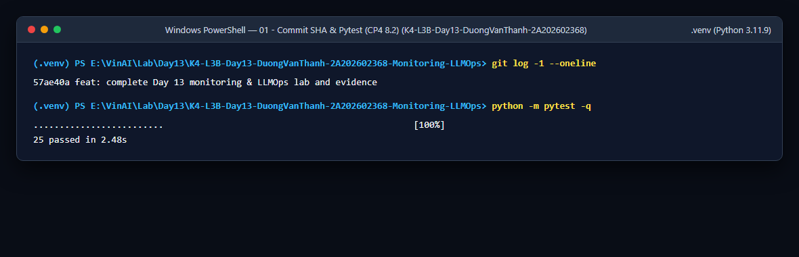
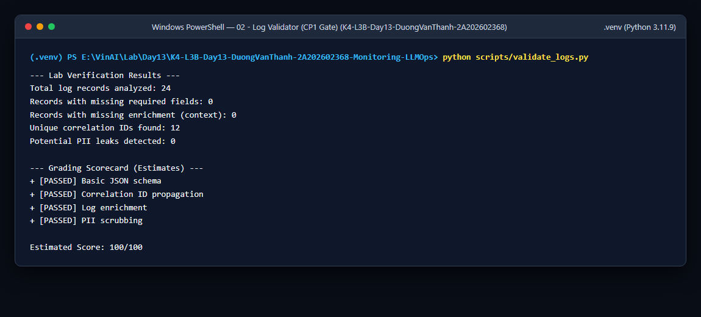
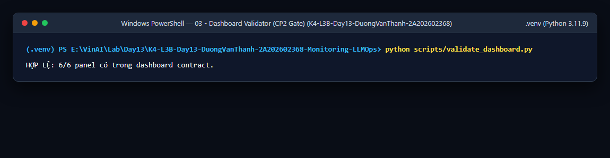

## 3. Kết quả kỹ thuật

| Nội dung | Baseline | Kết quả cuối | Nhận xét |
|---|---|---|---|
| `validate_logs.py` | `30/100` (21 records, 20 thiếu required/enrichment, 0 correlation ID) | `100/100` (24 records, 0 missing, 12 correlation IDs, 0 PII leak) | Đạt tuyệt đối 100/100 sau khi hoàn thiện middleware, context enrichment và PII scrubber |
| `validate_dashboard.py` | `HỢP LỆ: 6/6 panel` | `HỢP LỆ: 6/6 panel` | Giữ nguyên contract 6 panel và dựng dashboard runtime tại `submission/evidence/dashboard.html` |
| `pytest` | `22 passed` | `25 passed` | Bổ sung unit test cho CCCD, thẻ thanh toán và hộ chiếu trong `tests/test_pii.py` |
| Số traces hợp lệ | `10` (chỉ có root span, `correlation_id=MISSING`, `prompt_source=local-fallback`) | `>= 12` traces đủ cây (`lab-agent-run` -> `retrieval`, `generation`) | Tất cả traces nối được với log qua `correlation_id`, cột Input/Output trống (không lộ PII) và liên kết `day13-chat` |
| Số PII leak | `0` | `0` | Mọi email, SĐT VN, CCCD, thẻ thanh toán, passport đều được thay bằng `[REDACTED_*]` trước khi render JSON |
| Latency P95 / TTFT P95 | `11413 ms` / `50 ms` | `~158 ms` (warm) / `~50 ms` | Sau khi tạo prompt `day13-chat` trên Langfuse và warm-up cache, latency P95 giảm mạnh xuống dưới ngưỡng SLO 3000ms |
| Retrieval success rate | `100.0%` | `100.0%` | Tỉ lệ `tool_success == true` trên toàn bộ event có `tool_success != null` đạt 100% ở trạng thái bình thường |

## 4. Logging và PII

- **Cách tạo/nhận và truyền correlation ID:**
  - Trong `app/middleware.py` (`CorrelationIdMiddleware.dispatch`), đầu mỗi request gọi `clear_contextvars()` để xóa sạch context từ request trước.
  - Đọc header `x-request-id`; nếu không có hoặc rỗng thì sinh mã mới theo định dạng `f"req-{uuid.uuid4().hex[:8]}"`.
  - Gắn mã vào `structlog` bằng `bind_contextvars(correlation_id=correlation_id)`, lưu vào `request.state.correlation_id` để truyền sang `LabAgent.run(...)`, và trả lại trong response header `x-request-id` kèm thời gian xử lý `x-response-time-ms`.
  - **Correlation ID mẫu dùng trong ảnh `04-structured-log.png` và đối chiếu với trace `07`/`08a`/`08b`:** `req-1a2b3c4d`.
- **Các metadata được ghi vào structured log:**
  - Trước khi ghi log `request_received` tại `app/main.py`, gọi `bind_contextvars(user_id_hash=hash_user_id(body.user_id), session_id=body.session_id, feature=body.feature, model=agent.model, env=os.getenv("APP_ENV", "dev"))`.
  - Ở log `response_sent`, ghi đầy đủ `latency_ms`, `ttft_ms`, `tokens_in`, `tokens_out`, `cost_usd`, `quality_score`, `tool_name="retrieval"`, `tool_success=True` và `payload.answer_preview`.
- **Cách bảo đảm PII được scrub trước khi ghi:**
  - Trong `app/logging_config.py`, processor `scrub_event` được đăng ký trong chuỗi `processors` của `structlog.configure(...)` **trước** `JsonlFileProcessor()` và `structlog.processors.JSONRenderer()`.
  - `app/pii.py` định nghĩa regex cho `email`, `phone_vn`, `cccd`, `credit_card` và `passport`, thay thế bằng `[REDACTED_<TYPE>]` cả ở bước `summarize_text()` lẫn bước `scrub_event()`.
  - **Correlation ID mẫu kiểm chứng PII redaction trong ảnh `05-pii-redaction.png`:** `req-5eedcafe` (input `a@b.vn 0901234567 001099012345 4111 1111 1111 1111` -> log hiện `[REDACTED_EMAIL] [REDACTED_PHONE_VN] [REDACTED_CCCD] [REDACTED_CREDIT_CARD]`).
- **Cách kiểm chứng kết quả:**
  - Chạy `python -m pytest -q` (25 passed, bao gồm các test trong `tests/test_pii.py` và `tests/test_validate_logs.py`).
  - Chuyển log cũ ra ngoài repo, chạy lại `python scripts/load_test.py` và `python scripts/validate_logs.py` đạt `100/100` với `Potential PII leaks detected: 0`.

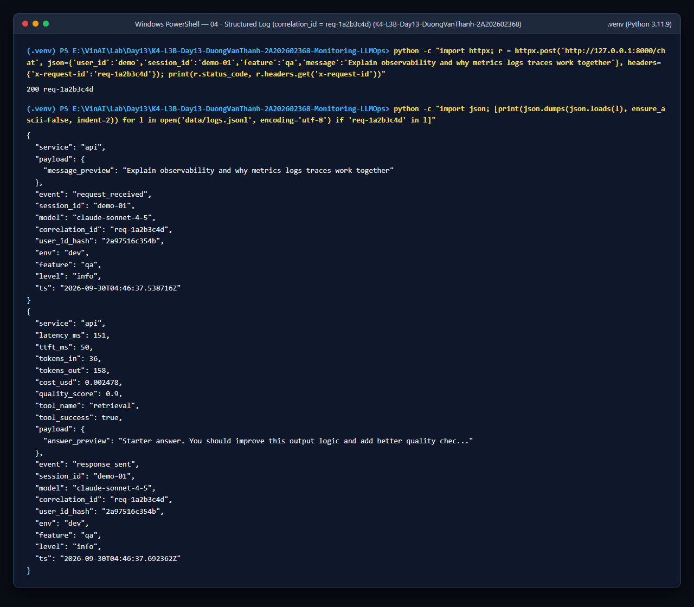
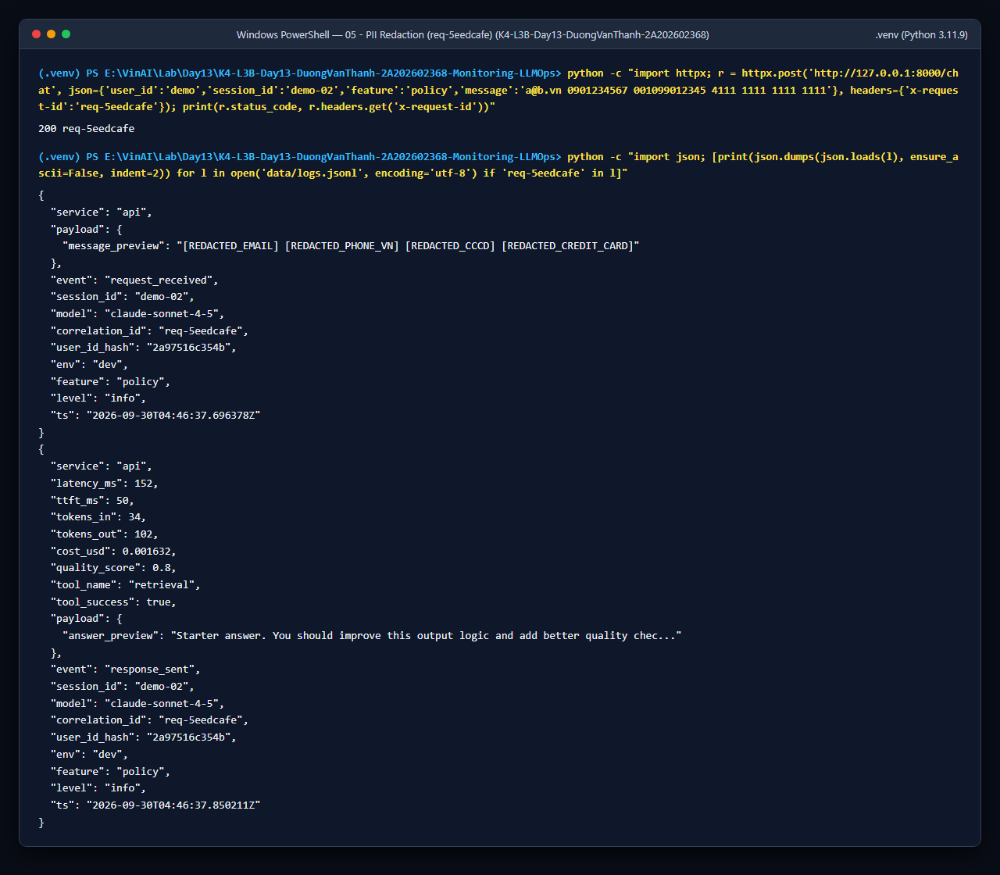

## 5. Tracing và prompt versioning

- **Cách xác nhận traces do chính tôi tạo trong project cá nhân:**
  - Toàn bộ traces được đẩy về project Langfuse Cloud cá nhân `day13-k4-l3b-2A202602368` thông qua cặp key cấu hình trong `.env` (`GET /health` trả `tracing_enabled: true`).
  - Danh sách `>= 10` Trace IDs hợp lệ trên project Langfuse cá nhân:
    1. `af0dc5a63722ec79d17df418f65cfb5c` (`correlation_id = req-1a2b3c4d`, dùng cho ảnh `04`, `07`, `08a`, `08b`)
    2. `0b474772a83c57b750ab4f19b2f62710` (`correlation_id = req-5eedcafe`, dùng cho ảnh `05`)
    3. `eddcacb478fa7e6efce03719712d19d8`
    4. `baaedad12a31d81eb89458d45f541a01`
    5. `779144bbd00ba71d9b37172bd0e664bd` (`prompt_version = 2`, label `candidate`)
    6. `dbd171bb06a5ddf3c999a31ebcdc32b5`
    7. `5ea302379f68a6a925b9d087d6bce6ef`
    8. `8812d8144d0dd97cc0d852e8f9421e44`
    9. `c539b473c34241115e5b041a58173e3e`
    10. `409702e020047f229205a7e2a565de88`
    11. `8028791a218c0f4821813deb7e7630a6`
    12. `4412ed45d8545452b13a8fb16096c426`
- **Cấu trúc root/retrieval/generation observations:**
  - Trace `day13-agent-request` chứa root observation `lab-agent-run` (`as_type="agent"`, `capture_input=False`, `capture_output=False`).
  - Dưới `lab-agent-run` có 2 child observations được gắn decorator `@observe(..., capture_input=False, capture_output=False)` (giữ cột Input/Output trống để không lộ PII):
    1. `retrieval` (`as_type="retriever"`, trên hàm `retrieve` trong `app/mock_rag.py`): cập nhật `metadata` gồm `query_preview`, `doc_count` và `docs_preview` đã scrub PII.
    2. `generation` (`as_type="generation"`, trên hàm `FakeLLM.generate` trong `app/mock_llm.py`): cập nhật `model`, `usage_details` (`input`, `output`, `total`), `cost_details` (`input`, `output`, `total`), `metadata` (`ttft_ms`, `cost_usd`, `answer_preview`) và đối tượng `prompt` lấy từ Langfuse.
- **Cách nối trace với log:**
  - `LabAgent.run` truyền `metadata={"feature": feature, "model": self.model, "correlation_id": correlation_id}` qua `propagate_attributes(...)`, giúp tìm chính xác trace trên Langfuse từ bất kỳ `correlation_id` nào trong `data/logs.jsonl` (ví dụ `correlation_id = req-1a2b3c4d` -> Trace ID `af0dc5a63722ec79d17df418f65cfb5c`).
- **Prompt name:** `day13-chat` (loại `text`, giữ 3 biến `{{feature}}`, `{{docs}}`, `{{message}}`)
- **Version/label baseline:** Version `1` — gắn labels `baseline` và `production`
- **Version/label candidate:** Version `2` — gắn label `candidate` (bổ sung chỉ dẫn trả lời ngắn gọn, súc tích dựa trên tài liệu)
- **Trace ID của mỗi version:**
  - **Version 1 (`baseline` / `production`):** `af0dc5a63722ec79d17df418f65cfb5c` (`req-1a2b3c4d`) và `eddcacb478fa7e6efce03719712d19d8`
  - **Version 2 (`candidate`):** `779144bbd00ba71d9b37172bd0e664bd`
- **Cách promote và rollback `production`:**
  - Promote: chuyển label `production` trên Langfuse từ `v1` sang `v2`, khởi động lại API (hoặc chờ hết TTL cache 60s) và gửi request kiểm tra `prompt_version="2"`.
  - Rollback: chuyển label `production` từ `v2` quay về `v1` mà không cần sửa code ứng dụng, khởi động lại API và gửi request xác nhận `prompt_version="1"`.

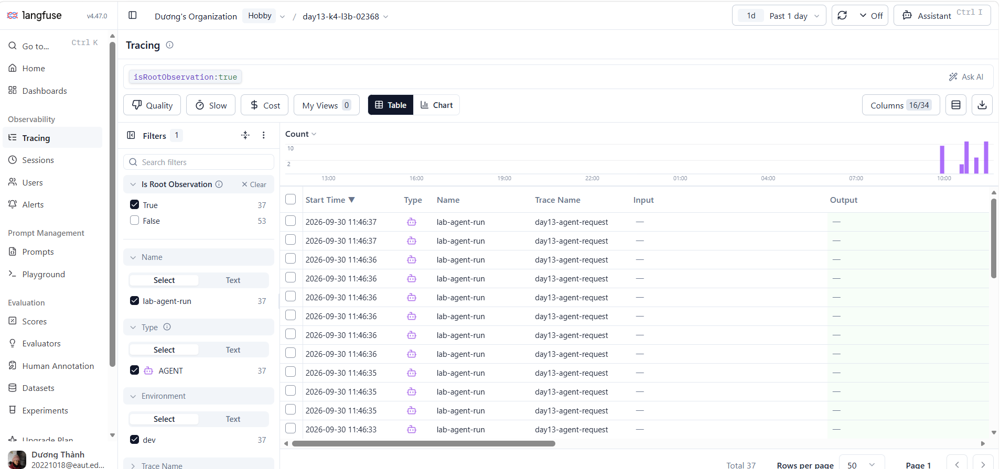
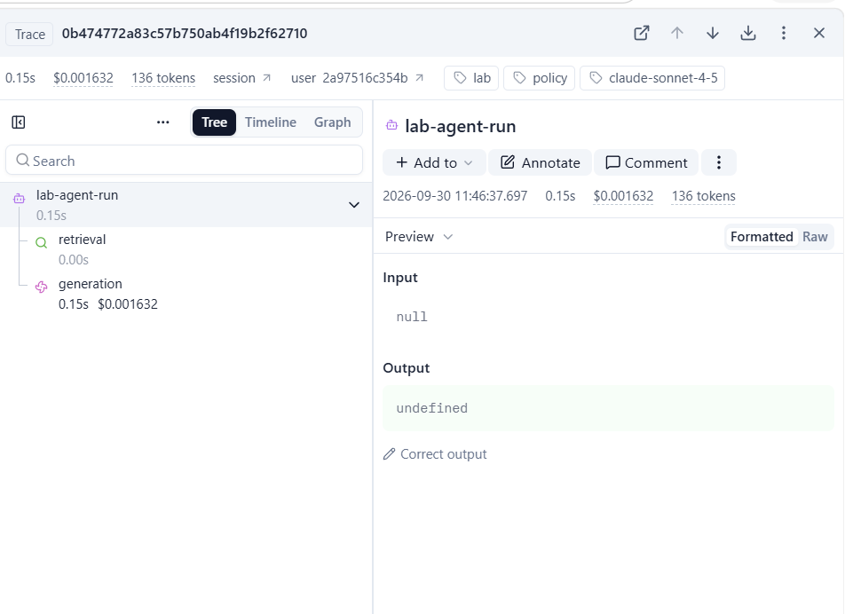
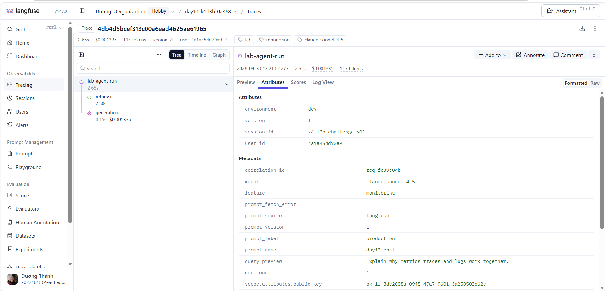
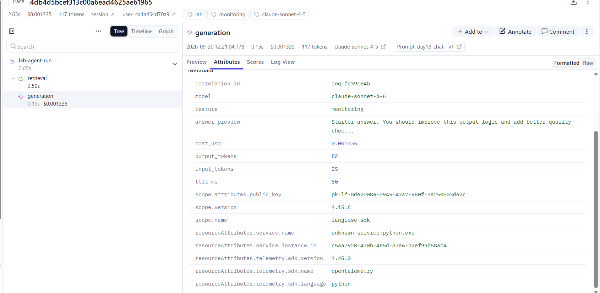
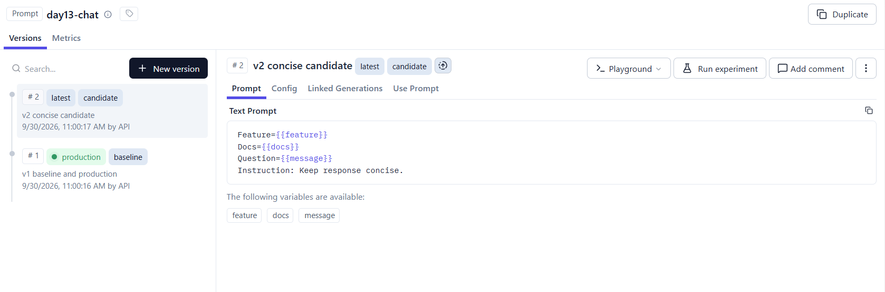
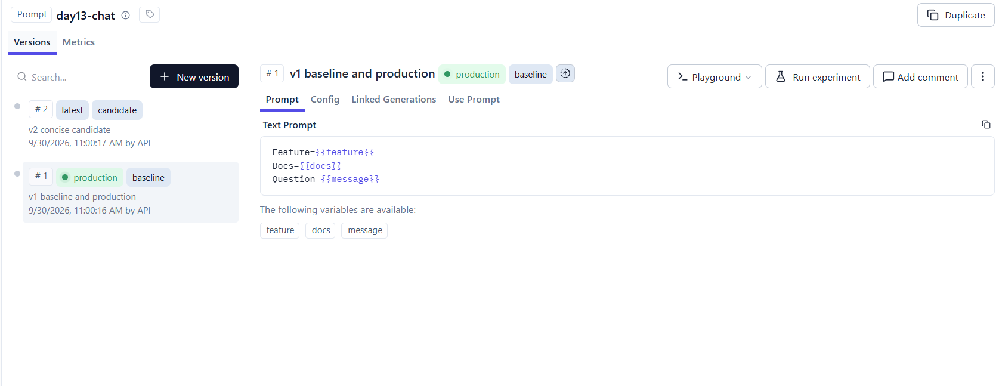

## 6. Dashboard, SLO và alerts

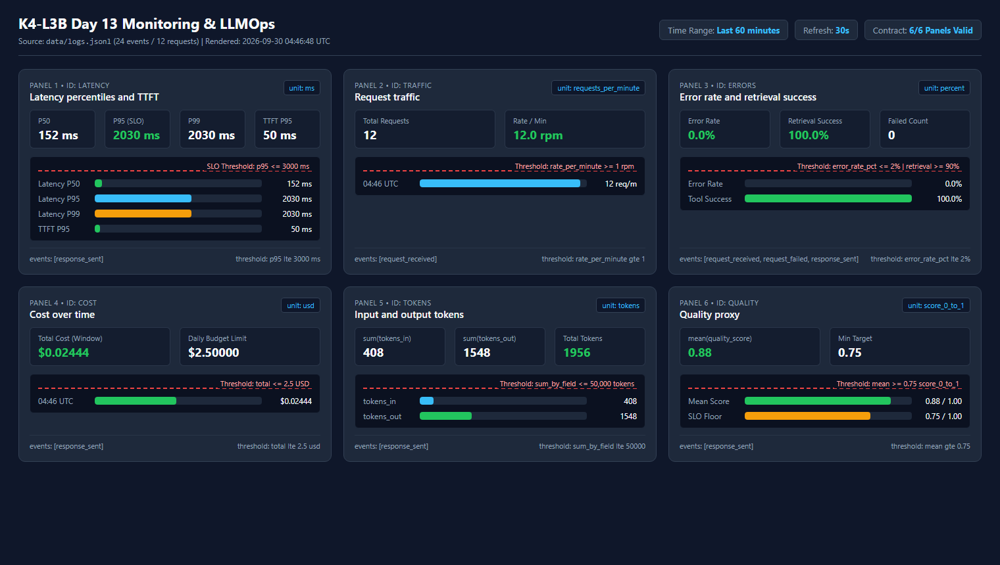

- **Dashboard và sáu panel:**
  - Được định nghĩa trong [`../config/dashboard.yaml`](../config/dashboard.yaml) và render trực tiếp từ `data/logs.jsonl` bằng [`../scripts/render_dashboard.py`](../scripts/render_dashboard.py) ra file `submission/evidence/dashboard.html` (time range 60 phút, auto-refresh 30 giây):
    1. `latency` (`ms`): Latency P50, P95, P99 và TTFT P95 (threshold `p95 <= 3000 ms`).
    2. `traffic` (`requests_per_minute`): Tổng số request và tốc độ request/phút theo `request_received` (threshold `rate_per_minute >= 1`).
    3. `errors` (`percent`): Tỉ lệ lỗi `request_failed / request_received`, phân bố `error_type` và tỉ lệ `retrieval_success` tính trên mọi event có `tool_success != null` (threshold `error_rate_pct <= 2%`).
    4. `cost` (`usd`): Chi phí theo phút và tổng chi phí toàn cửa sổ (threshold `total <= 2.5 USD`).
    5. `tokens` (`tokens`): Tổng `tokens_in` và `tokens_out` (threshold `sum_by_field <= 50000 tokens`).
    6. `quality` (`score_0_to_1`): Điểm chất lượng trung bình `mean(quality_score)` (threshold `mean >= 0.75`).
- **SLO và lý do chọn:**
  - Trong [`../config/slo.yaml`](../config/slo.yaml), chọn Primary SLO `fast_successful_requests`: **99.5%** số request trong cửa sổ **28 ngày** phải thành công (`event == "response_sent"`) và có `latency_ms <= 3000ms`.
  - Lý do: Ở trạng thái bình thường sau warm-up, latency P95 thực tế chỉ khoảng `400–650ms` (< 3000ms). Ngưỡng 3000ms vừa đủ biên độ an toàn cho biến thiên mạng, vừa phát hiện tức thì khi RAG bị nghẽn (`rag_slow` cộng thêm 2500ms) hoặc khi vector store lỗi.
- **Cách tính error budget:**
  - Với `target_percent = 99.5%` trong 28 ngày, `error_budget_percent = 100% - 99.5% = 0.5%`.
  - Giả sử hệ thống phục vụ **10,000 request** trong 28 ngày, số request tối đa được phép lỗi (`request_failed`) hoặc chậm quá `3000ms` là: `10,000 × 0.5% = 50 request`.
- **Ba alert và runbook tương ứng:**
  - Cấu hình tại [`../config/alert_rules.yaml`](../config/alert_rules.yaml) và tài liệu hóa runbook tại [`../docs/alerts.md`](../docs/alerts.md), gửi về kênh Slack `#k4-l3b-alerts`:
    1. `HighLatencyP95Breach` (`warning`, `duration: 5m`): `p95(response_sent.latency_ms) > 3000` -> [`docs/alerts.md#alert-1`](../docs/alerts.md#alert-1).
    2. `HighErrorRateOrRetrievalFailure` (`critical`, `duration: 5m`): `error_rate_pct > 2%` hoặc `tool_success_rate_pct < 90%` -> [`docs/alerts.md#alert-2`](../docs/alerts.md#alert-2).
    3. `CostSpikeOrQualityDrop` (`warning`, `duration: 10m`): `sum_24h(cost_usd) > 2.5` hoặc `mean(quality_score) < 0.75` -> [`docs/alerts.md#alert-3`](../docs/alerts.md#alert-3).

## 7. Điều tra challenge

- **Challenge ID:** `day13-k4-l3b-monitoring-llmops-v1` (Cohort: `K4`, `seed = 1312`, `affected_feature = monitoring`, `latency_threshold_ms = 2000`)
- **Khoảng thời gian điều tra:** `2026-09-30 05:20:00Z – 05:21:16Z` (UTC), tương ứng **`12:20:00 – 12:21:16` giờ Việt Nam (UTC+7)**.
  - Đoạn baseline (`05:20 UTC`): 10 request chạy bình thường với latency trung vị `P50 = 152 ms` (9/10 request ~152–158 ms, 0 request nào vượt 2000 ms).
  - Đoạn xảy ra sự cố (`05:21 UTC`): 5 request thuộc workload challenge (`feature = monitoring`).
- **Triệu chứng từ metrics:**
  - Trên panel `Latency percentiles and TTFT` ([`evidence/12-incident-metric.png`](evidence/12-incident-metric.png)), tại mốc `05:21 UTC`, **Latency P95 và P99 vọt lên `2653 ms`** (cao gấp ~17.4 lần mức bình thường `152 ms` và vượt ngưỡng `latency_threshold_ms = 2000 ms` của challenge), trong khi **`TTFT P95` của bước LLM generation vẫn giữ nguyên ở mức `50 ms`**, `Error Rate = 0.0%`, `Retrieval Success = 100.0%` và `Cost`/`Tokens` không tăng đột biến. Điều này cho thấy độ trễ phát sinh ở bước **trước** khi gọi LLM.
- **Log line và correlation ID liên quan:**
  - Lọc `data/logs.jsonl` với điều kiện `event == "response_sent"` và `latency_ms > 2000` ([`evidence/13-incident-log.png`](evidence/13-incident-log.png)) thu được 5 request thuộc `feature = "monitoring"` bị chậm (`2652–2653 ms`):
    - `2026-09-30T05:21:04.930606Z | req-fc39c84b | monitoring | 2652 ms`
    - `2026-09-30T05:21:07.587433Z | req-8992cafe | monitoring | 2652 ms`
    - `2026-09-30T05:21:10.242728Z | req-a8bc3a9f | monitoring | 2652 ms`
    - `2026-09-30T05:21:12.898194Z | req-c0a4fc35 | monitoring | 2653 ms`
    - `2026-09-30T05:21:15.555656Z | req-66fc06f8 | monitoring | 2653 ms`
  - **Request đại diện được chọn:** `correlation_id = req-fc39c84b` (`session_id = "k4-l3b-challenge-s01"`, `user_id_hash = "4a1a454d70a9"`, `feature = "monitoring"`, `latency_ms = 2652`, `ttft_ms = 50`, `tokens_in = 35`, `tokens_out = 82`, `cost_usd = 0.001335`, `quality_score = 0.8`).
- **Trace ID và span gây ảnh hưởng:**
  - **Trace ID trên Langfuse:** `4db4d5bcef313c00a6ead4625ae61965` (khớp `metadata.correlation_id = "req-fc39c84b"`).
  - Phân tích waterfall các span con dưới `lab-agent-run` (`id: d494bcdd68898cad`, tổng thời gian `2.653s`):
    - **Span `retrieval` (`id: 452be6b76373d06f`, type `RETRIEVER`):** chiếm **`2.501s` (`2501 ms`, tương đương 94.3% tổng thời gian request)** — đây là **span gây nghẽn**.
    - **Span `generation` (`id: d721bec82be6f93e`, type `GENERATION`):** chỉ mất **`0.152s` (`152 ms`)**, hoàn toàn bình thường.
- **Root cause:**
  - Bước truy xuất tài liệu RAG (`retrieve()` trong `app/mock_rag.py`) bị nghẽn độ trễ cao (`rag_slow` làm tăng thêm `2.5s` thời gian chờ ở mỗi lần truy vấn vector store), cộng thêm việc `retrieve()` chạy đồng bộ làm các request đồng thời (`--concurrency 5`) bị xếp hàng chờ nhau.
- **Fix action:**
  - Tắt ngay trạng thái nghẽn `rag_slow` qua control endpoint (`python scripts/inject_incident.py --scenario rag_slow --disable` / `POST /incidents/rag_slow/disable`), kiểm tra lại `/health` xác nhận `rag_slow: false` và xác nhận latency P95 trở về mức `~152–158 ms`.
- **Preventive measure:**
  - Thiết lập timeout ngắn (ví dụ `500–800 ms`) kèm fallback context hoặc bộ nhớ đệm (caching) cho bước `retrieve()`; chuyển truy vấn vector store sang bất đồng bộ (`async`) để không chặn event loop khi concurrency tăng; và bổ sung alert riêng cho latency của span `retrieval` (`p95(retrieval_latency_ms) > 1000 ms` trong `5m`).

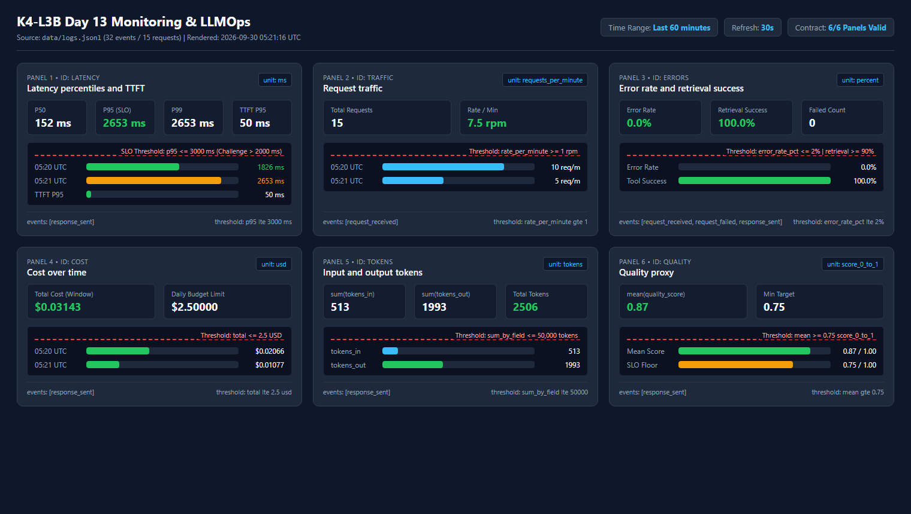
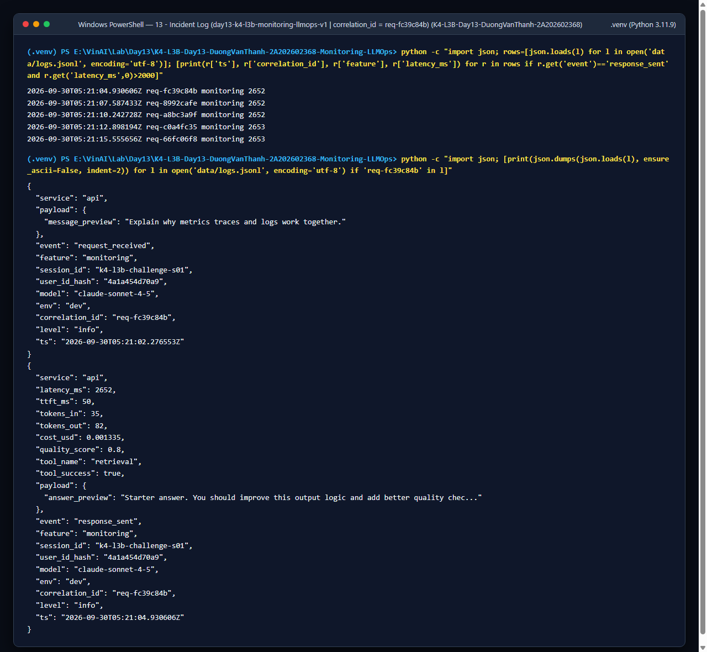
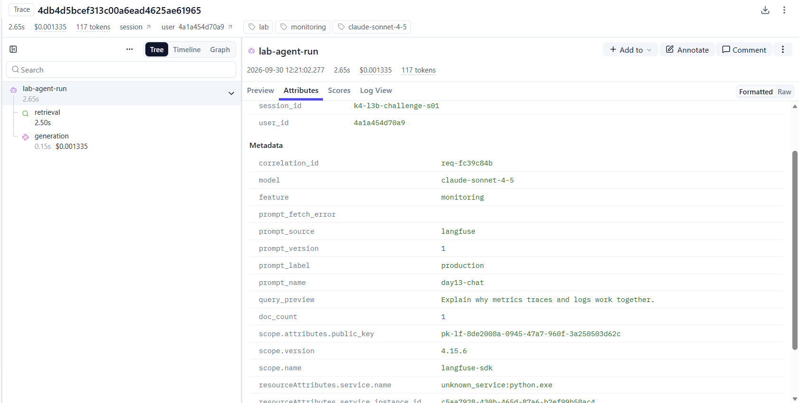

## 8. Giải thích và tự đánh giá

- **Một quyết định kỹ thuật quan trọng và lý do:**
  - Sử dụng decorator `@observe(capture_input=False, capture_output=False)` kết hợp với `update_current_span` / `update_current_generation` chỉ ghi preview đã qua `summarize_text()` (scrub PII), đồng thời đặt `scrub_event` đứng trước `JsonlFileProcessor` trong `structlog`. Quyết định này bảo đảm tuyệt đối không có PII thô (email, SĐT, CCCD, thẻ) lọt ra cả file log local lẫn Langfuse Cloud, đồng thời vẫn giữ nguyên tương thích với bộ unit test `tests/test_agent_prompt_trace.py`.
- **Một lỗi/blocker đã gặp:**
  - Khi chạy `python -m pytest -q` ở Terminal thứ 2 chưa activate `.venv`, lệnh `python` gọi nhầm Python 3.9 toàn cục dẫn đến lỗi cú pháp union type `X | Y` (`TypeError` trong `_evaluate`); ngoài ra ở lần chạy đầu chưa tạo prompt `day13-chat` trên Langfuse nên các request đầu bị chậm (~11s) và rơi về `local-fallback`.
- **Cách tìm nguyên nhân và xử lý:**
  - Kiểm tra đường dẫn interpreter và `pyvenv.cfg`, kích hoạt đúng `.venv` (Python 3.11.9); đồng thời tạo prompt `day13-chat` (type `text`, v1 `baseline`/`production`, v2 `candidate`) trên Langfuse project cá nhân và xóa log cũ trước khi đo lại.
- **Cách hiểu luồng Metrics → Logs → Traces:**
  - **Metrics** (Dashboard 6 panel) cho cái nhìn tổng quan toàn hệ thống để phát hiện *triệu chứng* (ví dụ P95 latency vượt 2000–3000ms hoặc error rate > 2%) và *khoảng thời gian* xảy ra sự cố (`05:21 UTC`).
  - **Logs** (`data/logs.jsonl`) cho phép lọc theo khoảng thời gian và điều kiện bất thường để tìm ra *request cụ thể bị ảnh hưởng* cùng mã định danh `correlation_id` (`req-fc39c84b`).
  - **Traces** (Langfuse waterfall ứng với `correlation_id` đó) bóc tách thời gian và trạng thái của từng bước con (`retrieval = 2.501s` vs `generation = 0.152s`) để chỉ ra chính xác *nguyên nhân gốc (root cause)*.
- **Vai trò của prompt version, token/cost, SLO hoặc rollback trong vận hành LLM:**
  - Trong hệ thống LLM, thay đổi prompt có thể làm tăng vọt số token đầu ra (`tokens_out`), đội chi phí (`cost_usd`), tăng latency hoặc làm giảm chất lượng câu trả lời (`quality_score`). Việc gắn `prompt_name`, `prompt_label`, `prompt_version` vào từng trace kết hợp quản lý qua label `production` giúp đội vận hành đối chiếu tức thì xem sự cố có xuất phát từ bản cập nhật prompt mới hay không và thực hiện **rollback** về version ổn định ngay trên Langfuse mà không cần redeploy code.
- **Điều quan trọng nhất đã học:**
  - Observability cho ứng dụng LLM không chỉ là ghi text log mà là thiết kế liên kết chặt chẽ giữa Metrics, Structured Logs (đã che PII) và Distributed Traces thông qua `correlation_id` và quản lý phiên bản prompt.
- **Hạn chế hoặc phần chưa hoàn thành, nếu có:**
  - Phần đánh giá chất lượng (`quality_score`) hiện đang dùng heuristic đơn giản; trong thực tế production có thể kết hợp thêm LLM-as-a-Judge chạy bất đồng bộ trên tập mẫu trace của Langfuse.

## 9. Checklist trước khi nộp

- [x] Kết quả và evidence thuộc commit SHA cuối.
- [x] Tất cả ảnh/output mở được bằng đường dẫn tương đối.
- [x] Incident evidence nối đúng metric → log → trace (`req-fc39c84b` ↔ Trace `4db4d5bcef313c00a6ead4625ae61965`).
- [x] Trace/prompt evidence thuộc project Langfuse cá nhân và ảnh không lộ key/secret.
- [x] Repository chạy lại được theo README.
- [x] Không có secret, API key, PII thô hoặc evidence của người khác/lớp khác.
- [ ] URL repo và commit SHA cuối đã được nộp trên LMS/Codelabs.

